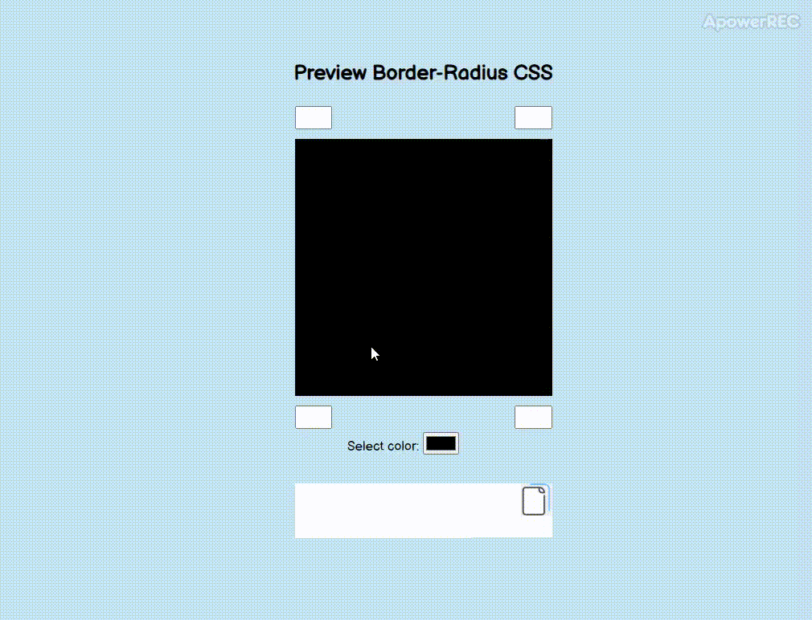

<h1>🟦🔵➰ Border_Radius_Previewer 🔵🟦➰</h1>

<h2>Set color and border radius</h2>
<h2>&#9654 Installation and start</h2>
<ul>
  <li>Clone repository</li>
  <li>Start file index.html</li>
</ul>
<h2>&#128187 Technology used</h2>
<ul>
  <li>Javascript</li>
  <li>HTML</li>
  <li>CSS</li>
</ul>